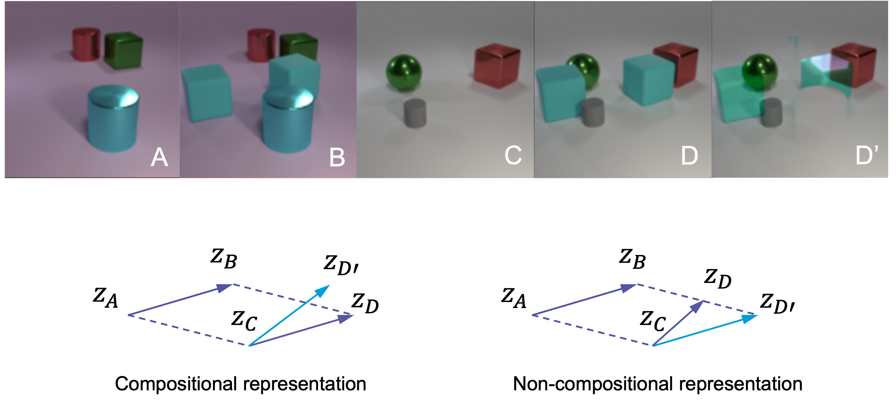
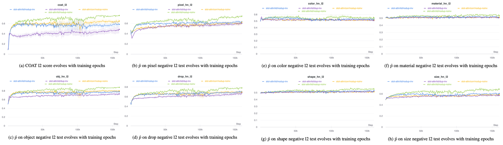
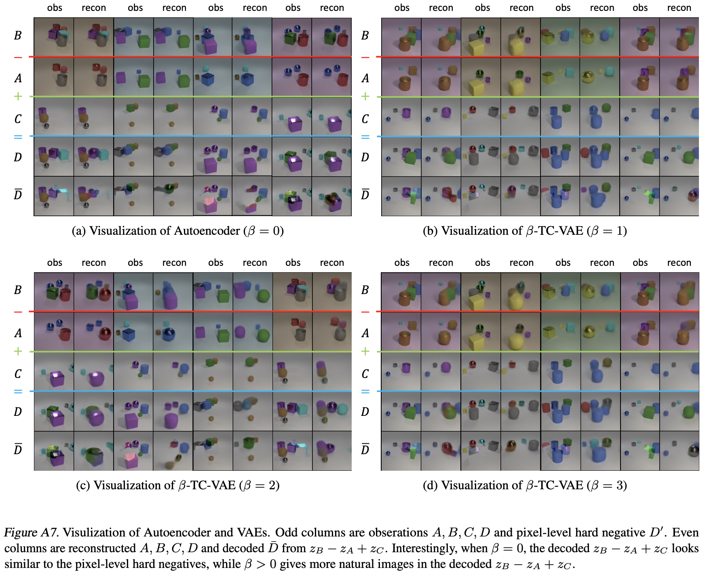
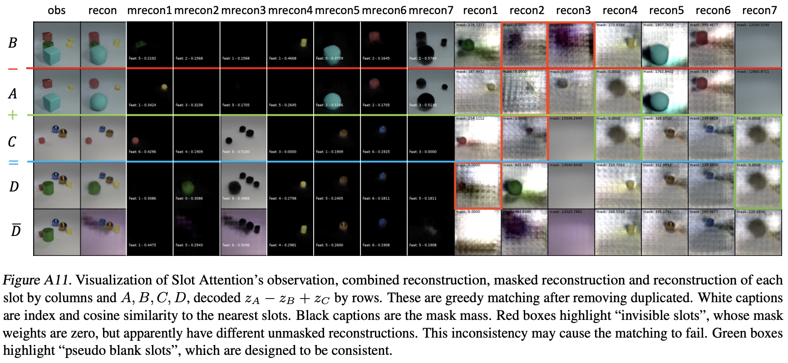
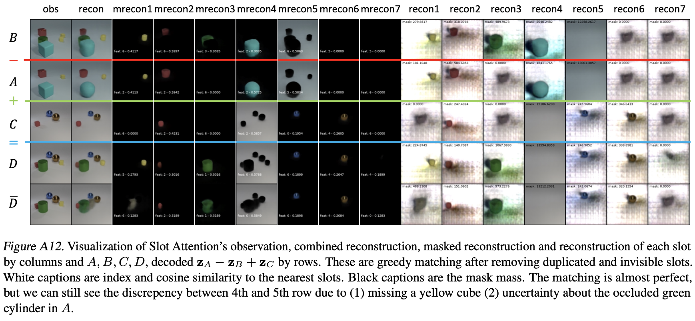

# COAT: Measuring Object Compositionality in Emergent Representations

The official code repository for "COAT: Measuring Object Compositionality in Emergent Representations"  
<br>
 <a href='https://siruixie.com'>Sirui Xie</a>,
 <a href='http://www.arimorcos.com/'>Ari Morcos</a>,
 <a href='http://www.stat.ucla.edu/~sczhu/'>Song-Chun Zhu</a>,
 <a href='https://vrama91.github.io/'>Ramakrishna Vedantam</a>
 <br>
 Presented at [ICML 2022](http://icml.cc/Conferences/2022).

[[Paper](https://proceedings.mlr.press/v162/xie22b.html)] [[Code](https://github.com/facebookresearch/objectness_score)] [[Data](https://dl.fbapipublicfiles.com/coat_data)]



## Requirements

- Python >= 3.8
- PyTorch >= 1.7.1
- Pytorch Lightning == 1.1.4
- hydra-core == 1.2.0
- tqdm
- CUDA enabled computing device


## Usage

This repository contains 
- The generation code for COAT testing corpus modified based on the [CLEVR generation code](https://github.com/facebookresearch/clevr-dataset-gen) 
- The generation code for Correlated CLEVR with colorful background based on the [CLEVR generation code](https://github.com/facebookresearch/clevr-dataset-gen)
- Pytorch implementation of [Slot Attention](https://arxiv.org/abs/2006.15055) and [beta-TC-VAE](https://arxiv.org/abs/1802.04942), modified based on repositories from [Untitled-AI](https://github.com/untitled-ai/slot_attention) and [AntixK](https://github.com/AntixK/PyTorch-VAE) respectively. The modification on Slot Attention mainly concerns the post-processing of deduplicating slots (controlled by `dup_threshold`) and removing invisible slots, i.e. slots with close-to-zero mask weight (controlled by `rm_invisible`). 
- The method `validation_epoch_end` in `method.py` for applying the COAT metric to slot-based representations and slot-free representations. 
 
### Data
The generated training and test data is available at [here](https://dl.fbapipublicfiles.com/coat_data). You probably should change the following data paths in the configuration files in `./hydra_cfg/`:

```python
data_mix_idx: 1 # the index of data mixture, check data_mix.csv for details
data_mix_csv: /your_data_root/data_mix.csv # the file for different composition of the training set
data_root:  /your_data_root/clevr_corr/ # training data for both iid and correlated CLEVR with colorful background
val_root: /your_data_root/clevr_with_masks/ # evaluation data from original CLEVR for mask ARI metric
test_root: /your_data_root/coat_test/ # testing data for our COAT metric
```

In the training data we provide, `data_mix.csv` is a meta file for different composition of training sets with different correlations. Set `data_mix_idx=1,2,3,4,5` for i.i.d. dataset; set `data_mix_idx=13,14,15,16,17` for the correlated dataset in our paper. 

To generate the test or the training data, check `./coat_generation/`. 

Our COAT measure can be expanded to domains other than CLEVR, the Dataset class `CLEVRAlgebraTestset` in `data.py` is reusable. It takes a list of tuples of images as input `test_cases: List[List[Optional[str]]]`. In `train_hydra.py`, such a list is loaded from `/test_root/obj_test_final/CLEVR_test_cases_hard.csv`, which is contained in our released data, with the following code:

```python
if os.path.exists(os.path.join(cfg.test_root, "obj_test_final", "CLEVR_test_cases_hard.csv")):
    with open(os.path.join(cfg.test_root, "obj_test_final", "CLEVR_test_cases_hard.csv"), "r") as f:
        csv_reader = reader(f)
        self.obj_algebra_test_cases = list(csv_reader)
else:
    self.obj_algebra_test_cases = None
    print(os.path.join(cfg.test_root, "obj_test_final", "CLEVR_test_cases_hard.csv")+" does not exist.")
```

### Training
Configuration files for models and training can be found in `./hydra_cfg/`, and should be linked to `hydra_train.py` with
```python
@hydra.main(config_path='hydra_cfg', config_name='cfg_file') 
""" 'cfg_file' can be either of 
    - 'bvae' for beta-tc-vae
    - 'slot-attn' for original slot attention model
    - 'slot-attn-no-dup' for slot attention model with duplicated slots removed
    - 'slot-attn-no-dup-no-inv' for slot attention model with duplicated slots and invisible slots removed. 
    
    Details of different post process on the representations can be found in the paper. 
"""
```

To train models from scratch with epoch-wise COAT test, run
```bash
python hydra_train.py
```
### Logging
We use [wandb](https://wandb.ai/site) to output logging. Logs should contain COAT metrics and test visualization. 

The COAT metrics include the COAT-l2 and the COAT-acos scores which are normalized and corrected for chance, as well as the empirical probability of P(Loss(A, B, C, D)<Loss(A, B, C, D')), where D' is the hard negative. Here are some example training curves.



The visualization shows how well the models reconstructs the images, as well as how well the slots are matched for Slot Attention. 

Here are some examples. 









## Citation

```
@inproceedings{xie2022coat,
  title={COAT: Measuring Object Compositionality in Emergent Representations},
  author={Xie, Sirui and Morcos, Ari S and Zhu, Song-Chun and Vedantam, Ramakrishna},
  booktitle={International Conference on Machine Learning},
  pages={24388--24413},
  year={2022},
  organization={PMLR}
}
```
