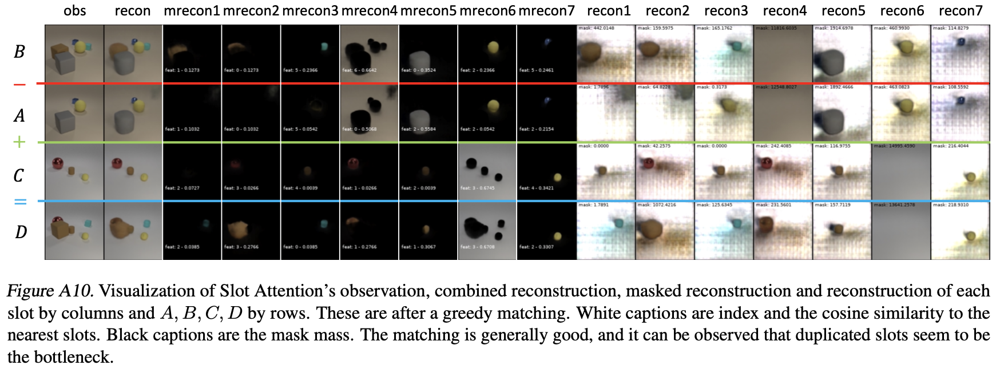

# COAT: Measuring Object Compositionality in Emergent Representations

The official code repository for ICML 2022 paper "COAT: Measuring Object Compositionality in Emergent Representations".

[[Paper](https://proceedings.mlr.press/v162/xie22b.html)] [[Code](https://github.com/facebookresearch/objectness_score)] [[Data](https://dl.fbapipublicfiles.com/coat_data)]


## Requirements

- Python >= 3.8
- PyTorch >= 1.7.1
- Pytorch Lightning == 1.1.4
- hydra-core == 1.2.0
- tqdm
- CUDA enabled computing device


## Usage

This repository contains 
- The generation code for COAT testing corpus modified based on the [CLEVR generation code](https://github.com/facebookresearch/clevr-dataset-gen) 
- The generation code for Correlated CLEVR with colorful background based on the [CLEVR generation code](https://github.com/facebookresearch/clevr-dataset-gen)
- Pytorch implementation of [Slot Attention](https://arxiv.org/abs/2006.15055) and [beta-TC-VAE](https://arxiv.org/abs/1802.04942), modified based on repositories from [Untitled-AI](https://github.com/untitled-ai/slot_attention) and [AntixK](https://github.com/AntixK/PyTorch-VAE) respectively. 
 
### Data generation
To generate the test or the training data, check `./coat_generation/`. 

### Training
Configuration files for models and training can be found in `./hydra_cfg/`, and should be linked to `hydra_train.py` with
```python
@hydra.main(config_path='hydra_cfg', config_name='cfg_file') 
""" 'cfg_file' can be either of 
    - 'bvae' for beta-tc-vae
    - 'slot-attn' for original slot attention model
    - 'slot-attn-no-dup' for slot attention model with duplicated slots removed
    - 'slot-attn-no-dup-no-inv' for slot attention model with duplicated slots and invisible slots removed. 
    
    Details of different post process on the representations can be found in the paper. 
"""
```

To train models from scratch with epoch-wise COAT test, run
```bash
python hydra_train.py
```
### Logging
We use [wandb](https://wandb.ai/site) to output logging. Logs should contain COAT metrics and test visualization. 

The COAT metrics include the COAT-l2 and the COAT-acos scores which are normalized and corrected for chance, as well as the empirical probability of P(Loss(A, B, C, D)<Loss(A, B, C, D')), where D' is the hard negative. Here are some example training curves.


The visualization shows how well the models reconstructs the images, as well as how well the slots are matched for Slot Attention. 

Here are some examples. 





## Citation

```
@inproceedings{xie2022coat,
  title={COAT: Measuring Object Compositionality in Emergent Representations},
  author={Xie, Sirui and Morcos, Ari S and Zhu, Song-Chun and Vedantam, Ramakrishna},
  booktitle={International Conference on Machine Learning},
  pages={24388--24413},
  year={2022},
  organization={PMLR}
}
```
