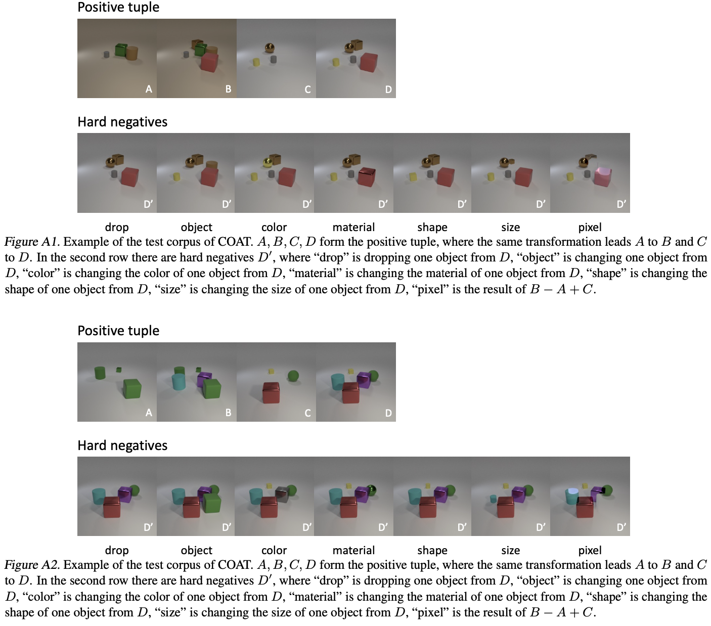
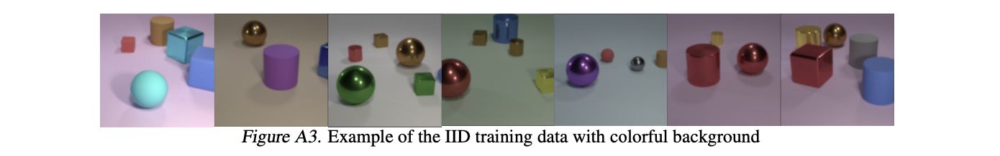
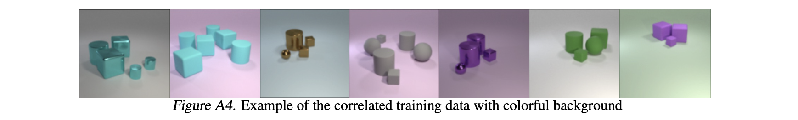

# COAT Dataset Generation

This is the code used to generate the testing corpus of [COAT](https://proceedings.mlr.press/v162/xie22b.html) as described in the paper:

**[COAT: Measuring Object Compositionality in Emergent Representations](http://cs.stanford.edu/people/jcjohns/clevr/)**
 <br>
 <a href='https://siruixie.com'>Sirui Xie</a>,
 <a href='http://www.arimorcos.com/'>Ari Morcos</a>,
 <a href='http://www.stat.ucla.edu/~sczhu/'>Song-Chun Zhu</a>,
 <a href='https://vrama91.github.io/'>Ramakrishna Vedantam</a>
 <br>
 Presented at [ICML 2022](http://icml.cc/Conferences/2022)

It is developed based on the original repo of [CLEVR](https://github.com/facebookresearch/clevr-dataset-gen). You can use this code to render synthetic images and construct testing corpus. 

The testing corpus consists of tuples with strongly occluded multi-object scenes. They are obtained through a rejection sampling with certain occlusion threshold. 



For image generation, we modified the original CLEVR generation code to introduce a colorful background and a spatially denser object distribution.



We also introduce correlation between objects to go beyond the i.i.d. prior in objects. 




## Step 1: Generating Images
First we render synthetic images using [Blender](https://www.blender.org/), outputting both rendered images as well as a JSON file containing ground-truth scene information for each image.

Blender ships with its own installation of Python which is used to execute scripts that interact with Blender; you'll need to add the `image_generation` directory to Python path of Blender's bundled Python. The easiest way to do this is by adding a `.pth` file to the `site-packages` directory of Blender's Python, like this:

```bash
echo $PWD/image_generation >> $BLENDER/$VERSION/python/lib/python3.5/site-packages/clevr.pth
```

where `$BLENDER` is the directory where Blender is installed and `$VERSION` is your Blender version; for example on OSX you might run:

```bash
echo $PWD/image_generation >> /Applications/blender/blender.app/Contents/Resources/2.78/python/lib/python3.5/site-packages/clevr.pth
```

You can then render some images.

```bash
blender --background --python render_images.py
```

On OSX the `blender` binary is located inside the blender.app directory; for convenience you may want to
add the following alias to your `~/.bash_profile` file:

```bash
alias blender='/Applications/blender/blender.app/Contents/MacOS/blender'
```

If you have an NVIDIA GPU with CUDA installed then you can use the GPU to accelerate rendering like this:

```bash
blender --background --python render_images.py -- --use_gpu 1
```

To render images for testing corpus instead of training, use:
```bash
blender --background --python render_test_images.py -- --use_gpu 1
```
This program outputs scene images at `ROOT+'/images/'`, scene images with a different background at `ROOT+'/bgs/'`, object masks at `ROOT+'/masks/'`, ground-truth information for all objects at `ROOT+'/scenes/'`, and an index-to-object mapping for each scene at `ROOT+'/meta/'`. The method `render_subscene_obj` renders images of all possible object subsets for `scene_struct`. 


You can find [more details about image rendering here](image_generation/README.md).


## Step 2: Generating Testing Tuples
Next we generate testing tuples for the rendered images generated in the previous step.
This step takes as input the single JSON file containing all ground-truth scene information, and outputs a list of tuples of image paths.

You can generate testing tuples with `obj_algebra_test` in `test_generation.py`
